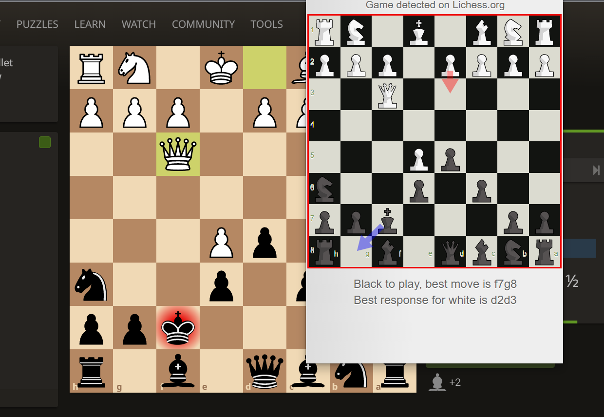

# What is Ramchess?

 A fun undetectable [lichess](lichess.org) AI extension that suggests the best next move while playing

 

# How to use it?
[Load an extension guide](https://developer.chrome.com/docs/extensions/mv3/agetstarted/#unpacked)

1. Go on and [download](https://github.com/Rxmsey/ramchess-lichess-browser-assistance/archive/refs/heads/main.zip) and unzip the folder.

2. Head to the [Edge extensions](edge://extensions/) page and `enable developer mode`

3. Click `Load unpacked` and then select the folder you downloaded.

4. Now you have uploaded the files to the browser, all you need to do is to go to the [Lichess site](https://lichess.org/) and click on the extension every time you struggle to find the best move, enjoy.

# NOTE:

USE IT ON YOUR OWN RISK, USING THIS IS AGAINST THE [LICHESS TOS](https://lichess.org/terms-of-service) I AM NOT RESPONSIBLE IF YOU GET BANNED
